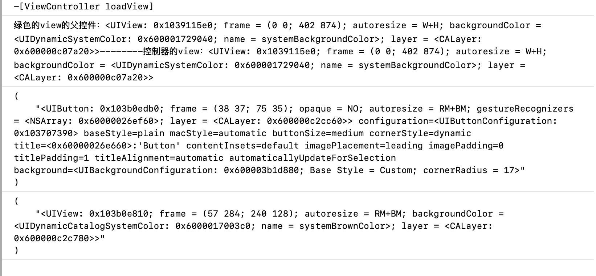
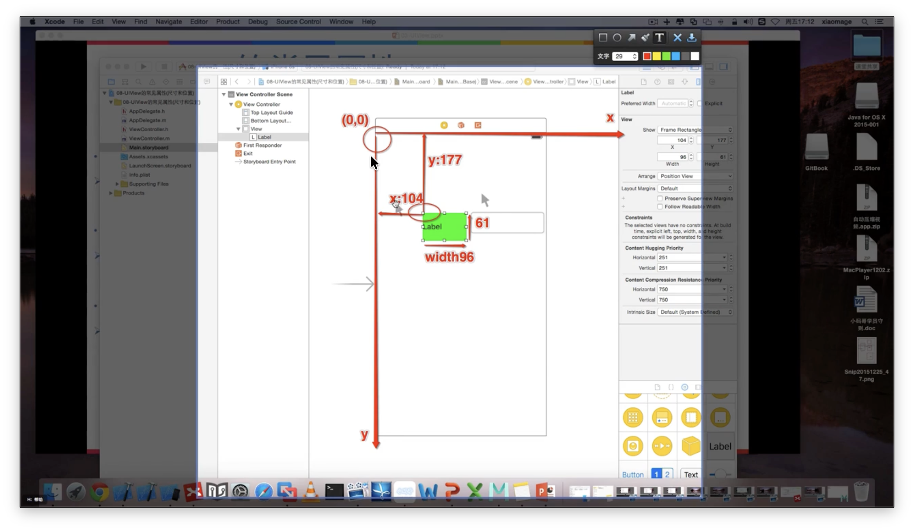

##  3.1UIview的简介

### 3.1.1父控件、子控件

- **每一个控件都是一个容器**

	1. 可以将其他控件放在空间内部

	2. 比较常见的还是**UIView**作容器

- **可以将A控件放入B控件**

	1. A是B的子控件

	2. B是A的父控件

- **每一个控制器都有一个UIview**

	1. 控制器本身不可见

	2. 能够看到的是控制器的View

	3. 每一个控制器都有一个UIView的属性

	4. 控制器中管理的所有子控件都是该控件的子控件
## 3.2UIview的常见属性：
### 3.2.1常见属性的示例

1. `@property(nonatomic, readonly) UIView *superview;`
    

	- 获得自己==父控件对象==
    

2. `@property(nonatomic , readonly,copy) NSArray *subviews;`
	- 获得自己的==所有子控件对象 ==


3.  `@property(nonatomic) NSInteger tag;` 
    * 控件的ID[标识]，父控件可以通过tag找到对应的子控件


4. `@property(nonatomic) CGAffineTransform transform;` 
    * 控件的形变属性[可以设置旋转角度，比例放缩、平移等属性]

5. `@property(nonatomic) CGRect frame;` 
    * 控件矩形框在父控件中的位置和尺寸（==以父控件的左上角为坐标原点）==
6. `@property(nonatomic) CGRect bounds;` 
    * 控件矩形框的位置和尺寸（以自己左上角为坐标原点，所以bounds的x、y一般为0）
7. `@porperty(nonatomic) CGPoint center;` 
    * 控件中点的位置（以父控件的左上角为坐标原点）

### 3.1.2 常见属性的代码展示
1. 系统调用相关
```objc
//

//  ViewController.m

//  UIview

//

//  Created by zjs on 2025/12/18.

//

  

#import "ViewController.h"

  

**@interface** ViewController ()

//绿色的view

**@property** (**weak**, **nonatomic**) **IBOutlet** UIView *greenview;

  

**@end**

  

**@implementation** ViewController

-(**void**)loadView{

    [**super** loadView];

    NSLog(@"%s",**__func__**);

}

  

/**

 1.系统调用

 2.控制器的view加载完毕时候调用

 3.控件的初始化，数据的初始化（懒加载）

 */

- (**void**)viewDidLoad {

    [**super** viewDidLoad];

    //1.1查看绿色的view的父控件和控制器的view，看两者是否是一样的

    NSLog(@"绿色的view的父控件：%@--------控制器的view：%@",**self**.greenview.superview,**self**.view);

    //1.2  查看绿色的view的子控件

    NSLog(@"%@",**self**.greenview.subviews);

    // 1.3查看控制器view的子控件

    NSLog(@"%@",**self**.view.subviews);

}

  

-(**void**)didReceiveMemoryWarning{

    [**super** didReceiveMemoryWarning];

}

/**

 1.系统调用

 2.当控制器接收到内存警告时调用

 3.去除一些不必要的内存，去除耗时的内存

 */

**@end**
```
2. 尺寸方法相关
```objc
//

//  ViewController.m

//  UIView_location

//

//  Created by zjs on 2025/12/19.

//

  

#import "ViewController.h"

  

**@interface** ViewController ()

**@property** (**nonatomic**,**weak**)UILabel *label;

**@end**

  

**@implementation** ViewController

  

- (**void**)viewDidLoad {

    [**super** viewDidLoad];

    //创建UILabel对象

    UILabel *label=[[UILabel alloc]init];

    //设置frame

    label.frame=CGRectMake(200, 200, 100, 100);

    label.backgroundColor=[UIColor yellowColor];

    //添加到控制器view中

    [**self**.view addSubview:label];

    **self**.label=label;

    // Do any additional setup after loading the view.

}

-(**IBAction**)bounds{

    //改变尺寸（iOS9以后 ， 中心点不变，向四周延伸）

    **self**.label.bounds=CGRectMake(0, 0, 200, 200);

}

//改变位置

-(**IBAction**)center{

   // self.label.center=CGPointMake(100,100);

    //显示在最中间--需要拿到父控件的高度和宽度各一半

    **self**.label.center=CGPointMake(**self**.view.frame.size.width*0.5, **self**.view.frame.size.height*0.5);

}

- (**IBAction**)ChangeSizeAndFrame{

    //方式1

    **self**.label.frame=CGRectMake(200, 100, 100, 60);

    //方式2

    //结构体是值传递，不是地址传递

    CGRect frame=**self**.label.frame;

    frame.origin.x +=100;//改变x值

    **self**.label.frame=frame;

}

**@end**
```
#### **为什么  为什么我不可以直接用``self.label.frame.origin.x+=100``
改变x的值，而要绕这么大一圈呢**
#### 解答（Gemini版）：
这是一个非常经典的问题，不仅困扰着 Objective-C 的初学者，也触及了 **C 语言语法**和 **Objective-C 内存机制**的核心细节。

简单来说，原因在于：**`frame` 不是一个变量，而是一个“属性（Property）”，且它对应的 `CGRect` 是一个“结构体（Struct）”。**

我们可以从以下三个层面来拆解：

---

### 1. 结构体是“值类型”（Value Type）

在 Objective-C 中，`CGRect`、`CGPoint`、`CGSize` 都是 C 语言的结构体。

- **结构体赋值是拷贝：** 当你调用 `self.label.frame` 时，系统并不是把 `label` 身上的那一块内存直接交给你修改，而是**复制了一份一模一样的副本**扔给你。
    
- 如果你能直接写 `self.label.frame.origin.x = 100;`，你其实是在修改那个“临时副本”，而原始 `label` 的位置根本没变。为了防止这种“改了白改”的逻辑错误，编译器干脆在语法层面直接**禁止**你这么做。
    

### 2. Setter/Getter 方法的本质

`self.label.frame` 在底层其实是调用了两个方法：

- **Getter:** `[self.label frame]`
    
- **Setter:** `[self.label setFrame:newFrame]`
    

当你尝试写 `self.label.frame.origin.x = 100` 时，编译器眼中的逻辑是这样的：

1. 调用 Getter 获取一个**临时**的 `CGRect`。
    
2. 修改这个临时 `CGRect` 的 `x` 值。
    
3. **没了。** 这里没有调用 Setter 把修改后的结构体重新塞回去。
    

> **比喻：** 就像你向银行申请看一眼你的存折（Getter）。银行印了一份**复印件**给你（副本）。你在复印件上把余额改多了（修改 x），但这不会改变银行数据库里的存款。你必须把改好的复印件交给柜员（Setter），柜员录入系统后，钱才真的变了。

### 3. C 语言的语法限制

在 C 语言中，函数的返回值（如果是一个结构体）被称为 **"R-value"（右值）**。右值是临时的、没有持久内存地址的，因此是不允许被直接赋值的。`self.label.frame` 返回的就是这样一个右值。

---

### 更好的写法建议

虽然你觉得“绕一圈”很麻烦，但在 Objective-C 开发中，这确实是标准操作。不过，你可以通过以下方式让代码更整洁：

#### A. 传统的“绕一圈”法（最安全）

就是你代码中的方式 2，先取出来，改完，再塞回去。这是最符合框架逻辑的做法。

#### B. 使用中心点（Center）

如果你只是想移动位置而不改变大小，修改 `center` 属性通常更方便：

Objective-C

```
CGPoint center = self.label.center;
center.x += 100;
self.label.center = center;
```

#### C. 如果是在 Swift 中（对比参考）

如果你以后转到 **Swift**，你会发现可以直接写 `label.frame.origin.x += 100`。 这是因为 Swift 的编译器更聪明，它在底层帮你自动完成了“取出来 -> 修改 -> 塞回去”的动作（这叫 _Mutation on Value Types_），但在老牌的 Objective-C 里，这些得你亲力亲为。

---

**总结：** 由于 Objective-C 的属性返回的是结构体的**拷贝**，直接修改副本的成员没有任何意义，所以编译器强制要求你重新给 `frame` 赋值。

既然你在研究代码和 UI 连线，需要我帮你解释一下如何通过 **Auto Layout（自动布局）** 来改坐标吗？在现代开发中，直接改 `frame` 其实已经越来越少见了。
### 3.2.3 图片展示（运行效果）



## 3.3UIview常见方法：
### 3.3.1常见方法示例

1. `-(void)addSubview: (UIView *)view;` 
    * 添加一个子控件view
2. `(void) removeFromSuperview;`
    * 将自己从父控件中移除
3. `-(UIView*) viewWithTag:(NSInteger)tag;` 
    * 根据一个tag标识找到一个对应的控件（一般都是子控件）

### 3.3.2常见方法的代码展示
```objc
//

//  ViewController.m

//  UIView_func

//

//  Created by zjs on 2025/12/19.

//

  

#import "ViewController.h"

  

**@interface** ViewController ()

//把红色的view拖进来

**@property** (**weak**, **nonatomic**) **IBOutlet** UIView *Redview;

  

**@end**

  

**@implementation** ViewController

  

- (**void**)viewDidLoad {

    [**super** viewDidLoad];

    //根据Redview tag拿到对应的view,然后与Redview相关的代码就可以不用加self.方法，但是由于有多余的连线，没办法直接运行

    UIView *Redview=[**self**.view viewWithTag:1];

    //如何用代码添加一个UISwitch？

    //1.1：创建UISwitch对象

    UISwitch *sw=[[UISwitch alloc]init];

    //1.2：加到控制器的view中(调用addSubview方法)

    [**self**.view addSubview:sw];

    //发现Switch被加载到了左上角（因为我们没有传入位置信息，所以默认左上角）

    // Do any additional setup after loading the view.

    //1.3为了将一个Switch传入红色的view，再次创建一个Switch对象

    UISwitch *sw1 = [[UISwitch alloc]init];

    //1.4加载到红色的view

    [Redview addSubview:sw1];

    //1.5创建一个选项卡对象

    UISegmentedControl *sg=[[UISegmentedControl alloc]initWithItems:@[@"hhhhhhhh",@"哈哈",@"嘻嘻"]];

    //1.6加载到红色的view(发现和之前的Switch位置重合了)

    [Redview addSubview:sg];

    //1.7解决方案：移除

    [sg removeFromSuperview];
    [self.redView removeFromSuperview];
    [sw removeFromSuperview];

}
//只要有父控件，就一定可以移除(包括view这个最大的控件)
-(void)viewDidAppear:(BOOL)animated
{[super viewDidAppear:animated];
[self.view removeFromSuperview];
}
-(IBAction)remove{
[self.redView removeFromSuperview]
}
  

  

**@end**
```


## 3.4 尽量不要使用tag方法！

原因：

* 算法上效率低（很可能是递归调用，效率很低）
	* 用伪代码表示
	* ```objc
	  -(UIView *)viewWithTag:(NSInteger)tag{
	  if(self.tag==tag)return self;
	  for(UIView *subView in self.subviews)
	  {
	  if(subView.tag==tag)
	  return subView;
	  //继续递归遍历
	  //..
	  }
	  }
	  ```
* 工程上容易乱

使用场景：在多个控件要实现公共部分和私人部分两种场景是，可以用tag能打上标记的性质来用case方法代替if else的嵌套循环，增加可读性。

